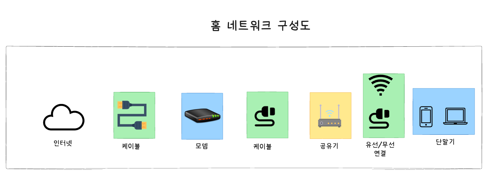
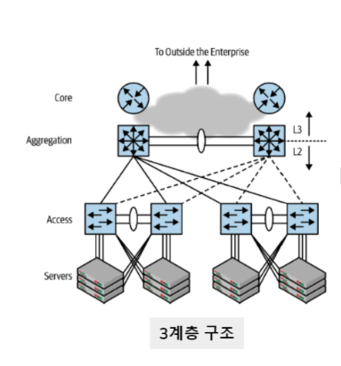
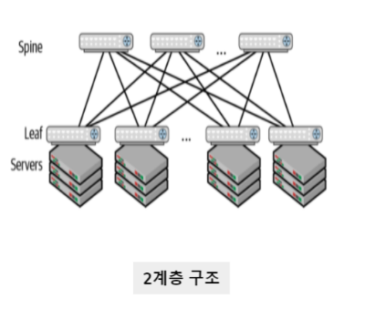
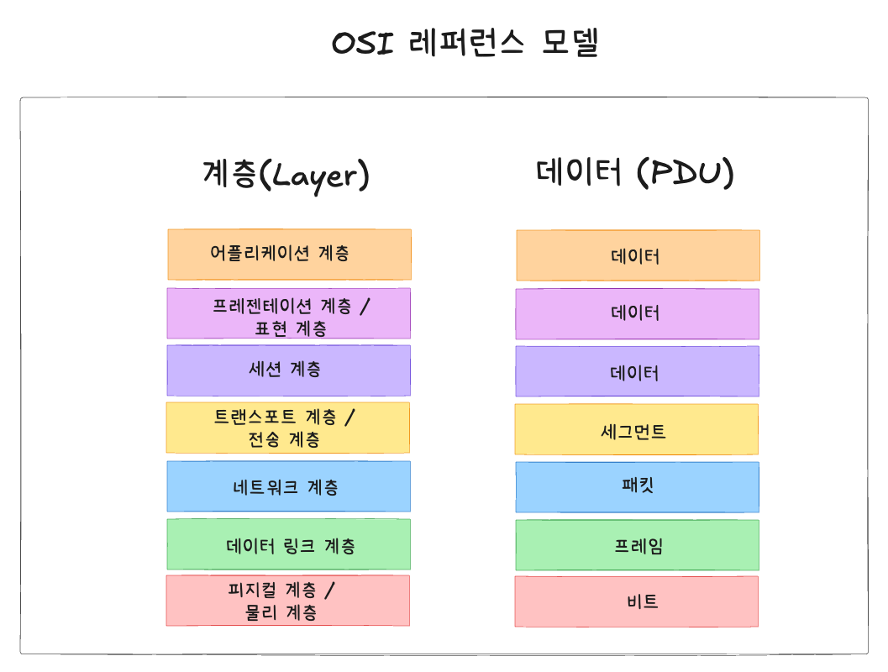
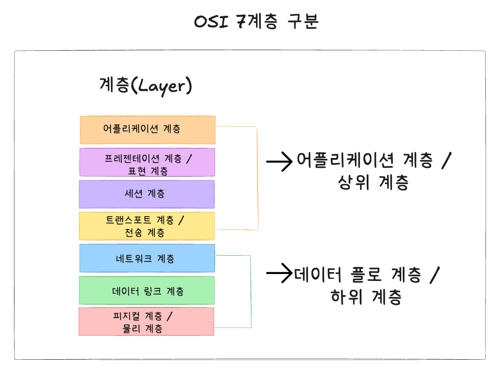
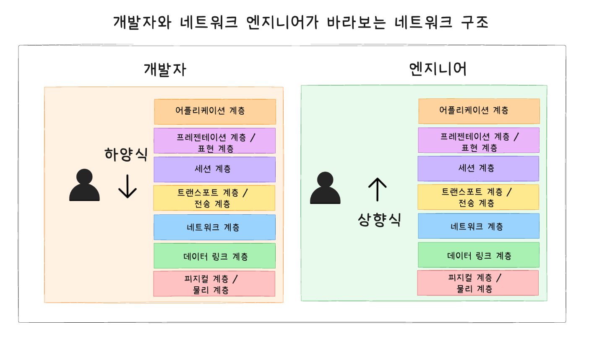
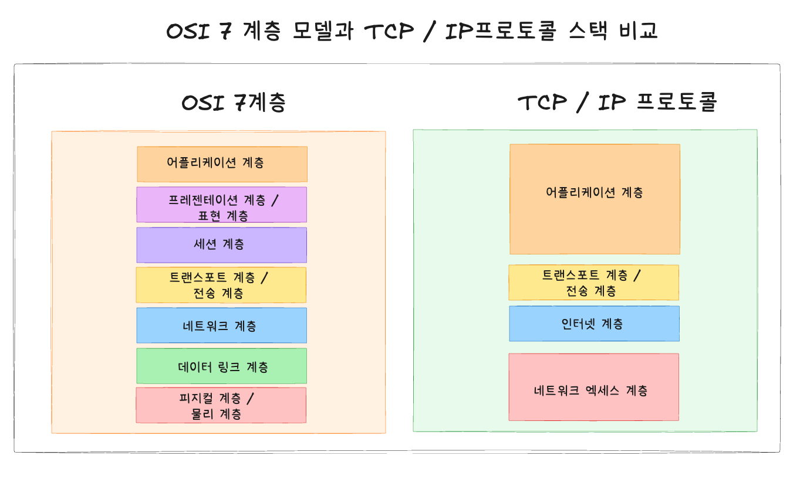

## 1강. 네트워크 시작하기

---

### 🚩 목차

## 1️⃣ 네트워크 구성도 살펴보기

**네트워크 사용자 별의 구분**

1. **네트워크 서비스 사용자**
- 인터넷을 이용하여 사용하는 입장

2. **네트워크 서비스 제공자**
- 클라우드, 데이터 센터 등 회사 전산실

### 홈 네트워크

**홈 네트워크 구성도**



**홈 네트워크를 구성하는데 모뎀, 공유기, 모바일 혹은 노트북(단말기) 간 연결이 필요**

- 유선 연결과 무선연결(와이파이 등)으로 구분됨

<br/>

1. **유선 연결(케이블)**
- 유선 랜 카드(이더넷 렌 카드) 혹은 랜 케이블(랜선)이 필요함

2. **무선 연결(와이파이)**
- **와이파이 공유기 혹은 무선 랜 카드가 필요**

<br/>

### 데이터 센터 네트워크

**안정적이고 빠른 대용량 서비스 제공을 목표로 구성함**

- 안정적인 서비스 제공을 위해 다양한 이중화 기술을 사용하고, 많은 서버와 서비스가 한 네트워크에 연결됨으로 많은 통신량을 수용하기 위해 고속 이더넷 기술을 사용함

**과거 - 3계층 디자인 구성**
- **계층적인 디자인 구조**



<br/>

**현재 - 2계층 디자인 구성**

- **가상화 기술과 높은 대역폭을 요구하는 스케일 아웃 기반의 어플리케이션과 서비스가 등장하면서 2계층 구성인 스파인 - 리프 구조로 변경됨**



<br/>

**➕ 계층적 디자인(3계층) vs 스파인 - 리프 구조(2계층)**

**계층적 디자인(3계층)**
- 단말의 트래픽이 외부 영역으로 이동하기 위해 코어 영역으로 집중되는 환경에서 효율적
- 각 지역간 링크를 최소화하고, 2대의 장비가 각 Layer에 이중화로 구성되어 Fail-Over를 수행
- 성능 개선을 위해서는 트래픽이 집중되는 코어와 분산 스위치의 업그레이드 필요(Scale-Up)

<br/>

**스파인 - 리프(2계층)**
- 데이터 센터의 트래픽이 수직적에서 수평적(서버간 통신 증가)으로 변화되는 것을 효과적으로 대응하기 위해 적용됨
- 성능 개선을 위해서는 트래픽 분산을 위한 Spine 스위치를 추가 연결하는 구조(Scale-Out)
- 작은 포트 수의 고정적 스위치로 논 블로킹(non-blocking)기반의 대규모 네트워크 구축 가능

<br/>

## 2️⃣ 프로토콜

프로토콜 정의

- **네트워크 상에서 컴퓨터끼리 통신하기 위한 규칙 / 규약**

<br/>

**프로토콜 규정 요소**

**물리적 측면**
- 데이터 전송 매체, 신호 규약, 회선 규격 등 이더넷이 널리 사용됨

**논리적 측면**
- 장치들끼리 통신하기 위한 프로토콜 규격, TCP/IP가 널리 사용됨

**발전 역사**

- 네트워크 서비스들이 처음 개발되었던 1900년대의 적은 컴퓨팅 자원과 매우 느린 네트워크 속도를 이용하여 최대한 효율적으로 통신되는 것이 목표로 구현되다 보니, 대부분 프로토콜이 문자가 아닌 **2진수 비트 기반으로 만들어짐**

→ 최소한의 비트로 내용을 전송하기 위해 매우 치밀하게 서로 간의 약속을 정의해야 했음

- **어플리케이션 레벨의 프로토콜은 비트 가반이 아닌 문자 기반의 프로토콜을 사용하여 헤더와 헤더 값, 데이터를 표현하고 전송함**

→ 실제 텍스트 파일과 같은 데이터가 전달되기 때문에 **효율성은 비트 기반 프로토콜보다 떨어지지만 다양한 확장이 가능함**

**ex. HTTP, SMTP 등**

**예시 - HTTP 프로토콜 헤더**

``` HTTP
GET /index.html HTTP/1.1
Host: www.example.com
User-Agent: Mozilla/5.0 (Windows NT 10.0; Win64; x64) AppleWebKit/537.36 (KHTML, like Gecko) Chrome/89.0.4389.82 Safari/537.36
Accept: text/html,application/xhtml+xml,application/xml;q=0.9,*/*;
```

<br/>

**➕ 이더넷**

- 이더넷(Ethernet)은 컴퓨터 네트워크 기술의 하나로, 주로 로컬 영역 네트워크(LAN)에서 데이터를 전송하는 표준 방식
- 이더넷은 유선 연결을 통해 여러 장치 간에 데이터를 빠르고 안정적으로 교환할 수 있도록 설계되었으며, 네트워크 케이블과 스위치를 사용하며, 데이터 전송을 위한 규칙(프로토콜)을 정의함

<br/>

## 3️⃣ OSI 7 계층과 TCP/IP

### OSI 7계층

- OSI(Open Systems Interconnection)이라는 통신 규약을 만들 때 고안된 OSI 통신 기능을 7개의 계층을 나눈 것
- OSI 자체는 현재 사용되고 있지 않지만, 다양한 분야에서 공통적으로 참조할 수 있는 **참조 모델**로 현재도 사용되고 있음

→ 참조 모델이 되면서 엔지니어가 서로 공용할 수 있는 공통 언어의 역할도 담당함

→ 계층별로 표준화된 프로토콜 템플릿을 개발하는 대신 계층별로 프로토콜을 개발하여 네트워크 구성 요소들을 **모듈화**하여 사용함

<br/>

**OSI 레퍼런스 모델**



<br/>

**OSI 7계층의 구분**

- **1 ~ 4계층: 데이터 플로 계층 / 하위 계층**
    - 데이터를 상대방에게 전달하는 역할
    - 어플리케이션 개발자는 개발 시 하위 계층을 고려하지 않은 채, 데이터를 표현하는데 초점을 둠

  → 네트워크 엔지니어가 고려함


- **5 ~ 7계층: 어플리케이션 계층 / 상위 계층**
    - 데이터를 어떻게 표현하는지 역할
    - 엔지니어는 상위 계층을 고려하지 않고, 데이터를 어떻게 전송되는지에 초점을 둠

  → 개발자들이 고려함




<br/>

**👨🏻‍🏫 정리**

- **어플리케이션 개발자는 하양식으로 네트워크를 바라봄**
- **네트워크 엔지니어는 상향식으로 네트워크를 바라봄**



<br/>

### TCP/IP 계층 프로토콜 스택

- 현대의 네트워크의 대부분은 TCP / IP와 이더넷으로 구성됨
- TCP/IP는 네트워크 이론보다 실용성에 중점을 둔 프로토콜
- **TCP / IP 프로토콜을 이용하여 OSI 7계층의 상위 계층과 하위 계층으로 구분 시, 보다 명확하게 계층간 분리를 목적으로 만들어짐**



<br/>

**➕ OSI 7계층과 TCP/IP 프로토콜에 대해서 설명해보시오**

- **OSI 모델은 네트워크 통신의 구조와 기능을 설명하는 이론적 모델이며, TCP / IP 프로토콜 스택은 실제 네트워크에서 사용되는 프로토콜 모델입니다. OSI 모델은 7계층으로 구성되어 있고, TCP / IP는 4계층으로 구성되어 있습니다.**

**👩🏻‍🏫  OSI 7계층과 TCP / IP 모델 추가 자료**

1️⃣ **OSI 모델의 각 계층별 역할은 무엇인가요?**

- OSI 모델은 7개의 계층으로 구성되어 있으며 다음과 같은 역할을 합니다.
    - 물리 계층: 데이터 전송을 위한 물리적 매체와 신호를 다룹니다.
    - 데이터 링크 계층: 프레임의 전송, 오류 검출 및 수정, MAC 주소를 통한 장치 간 통신을 담당합니다.
    - 네트워크 계층: IP 주소를 이용하여 패킷의 라우팅과 주소 지정합니다.
    - 전송 계층: TCP와 UDP 프로토콜을 이용하여 흐름 제어 및 오류 복구 기능을 제공합니다.
    - 세션 계층: 통신 세션의 설정, 유지 및 종료를 관리합니다.
    - 표현 계층: 데이터의 형식 변환, 암호화 및 압축을 수행합니다.
    - 응용 계층: 사용자와 상요작용하는 어플리케이션 계층을 포함합니다.

<br/>

**2️⃣ TCP / IP의 각 계층은 무엇을 담당하나요?**

- TCP / IP 프로토콜을 4개의 계층으로 구성되어 있으며, 다음과 같은 역할을 합니다.
    - 응용 계층: 사용자 어플리케이션과 관련된 프로토콜( HTTP, FTP, SMTP)을 처리합니다.
    - 전송 계층: TCP와 UDP를 통해 데이터 전송의 신뢰성 및 흐름 제어를 관리합니다.
    - 인터넷 계층: IP 프로토콜을 통해 패킷의 주소 지정 및 라우팅을 수행합니다.
    - 네트워크 접근 계층: 물리적 네트워크 접속과 데이터 링크 프로토콜을 포함하여 실제 데이터 전송을 담당합니다.

<br/>

**3️⃣ OSI 모델과 TCP / IP의 주요 차이점은 무엇인가요?**

- OSI 모델은 이론적이고 구조적인 접근 방식을 제공하며 7개의 계층으로 구성되어 있습니다. 반면, TCP/IP 프로토콜 스택은 실용성을 중시하여 4개의 계층으로 단순화되어 있습니다. OSI 모델은 각 계층의 세부적인 역할을 명확히 정의하는 반면, TCP/IP는 각 계층의 기능이 좀 더 유연하게 통합되어 있어 실제 네트워크에서의 효율적인 작동에 중점을 두고 있습니다.

<br/>

**4️⃣ TCP와 UDP의 차이점은 무엇인가요?**

- TCP(Transmission Control Protocol)는 연결 지향적이며 신뢰성 있는 데이터 전송을 보장합니다. 데이터 전송 중 오류가 발생하면 재전송을 통해 신뢰성을 유지합니다. 반면, UDP(User Datagram Protocol)는 비연결형으로 빠른 전송을 중시하며, 오류 검출이나 재전송 기능이 없습니다. 따라서 실시간 애플리케이션(예: VoIP, 온라인 게임)에서 주로 사용됩니다.